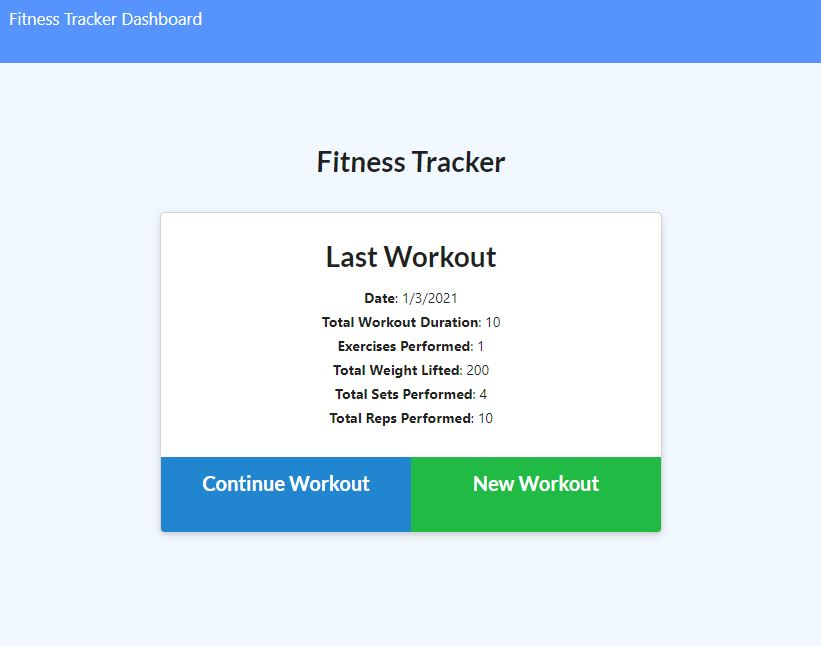

# Workout-Tracker

## Table of Contents
* [ Deployed Site ](#Deployed-Site)
* [ Description ](#Description)
* [ Installation ](#Installation)
* [ License ](#License)
* [ Contact Me ](#contact)

## Deployed Site
* https://the-best-fitness-tracker.herokuapp.com/

## Description
* This application allows users to track their workouts by creating a new workout or continuing an old one! The user can then check their dashboard to see their workout statistics.

## Installation
* Clone down the repo
* Install npm packages by opening your terminal inside of the application repo and typing 'npm i'
* Open on you local machine by going to localhost:3030!

## License
* This project is [MIT](https://choosealicense.com/licenses/mit/) licensed. 

## Questions? Contact Me! 
* Github: https://github.com/dianalynshull
* Email: dianalynshull@gmail.com
* Preferred Contact: Email
